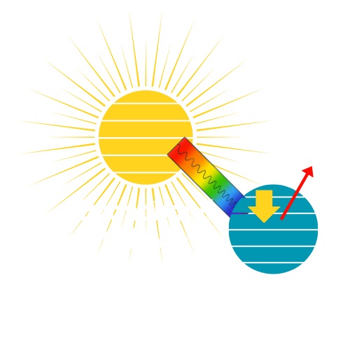
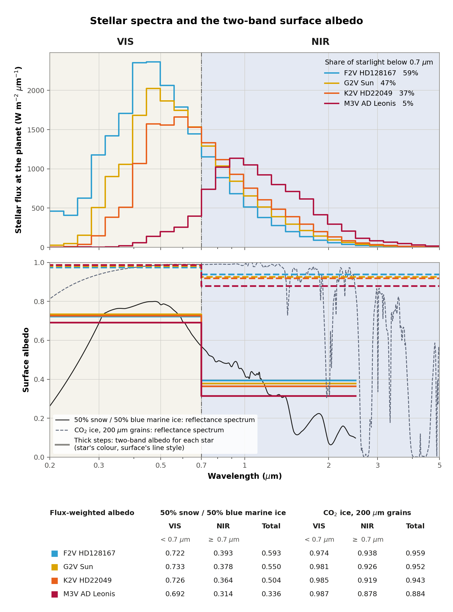
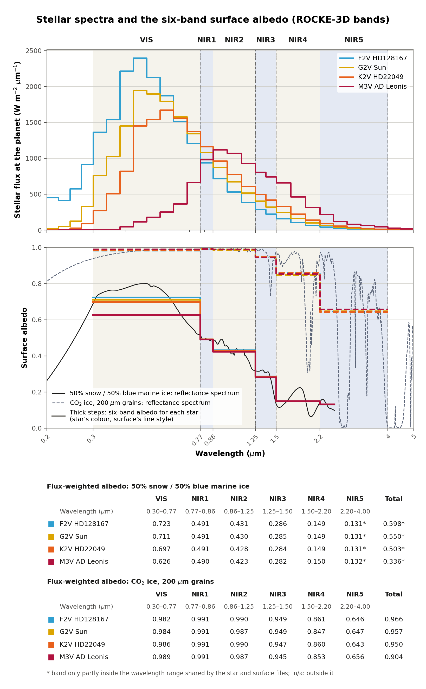

# Broadband Albedo Calculator

[](https://doi.org/10.5281/zenodo.16813647)

Computes the broadband albedo of a surface from a stellar spectrum and a
surface reflectance spectrum. The results can be used as input to energy
balance models and global climate models. This is a Python version of the IDL
routine `ice_gcm.pro`.



## Requirements

Python 3 with NumPy, SciPy and Matplotlib.

## Installation

```bash
git clone https://github.com/astrovidee/Broadband_albedo_Calculator.git
cd Broadband_albedo_Calculator
```

## Usage

One script, `Broadband_albedo_calculator.py`, does everything. It runs every
star with every surface, prints the albedo in each band and saves one figure
per band set.

```bash
python Broadband_albedo_calculator.py              # two-band and six-band
python Broadband_albedo_calculator.py --bands 2    # two-band only
python Broadband_albedo_calculator.py --bands 6    # six-band only
```

| Band set | Bands | Suits | Figure saved |
|---|---|---|---|
| Two-band | VIS and NIR, split at 0.7 µm | 1-D energy balance models, ExoCAM | `two_band_albedo.png` |
| Six-band | VIS and NIR1 to NIR5 | ROCKE-3D | `six_band_albedo.png` |

Each figure shows the stellar spectra in wavelength bins, the reflectance
spectrum of each surface with the band albedos for each star drawn over it,
and a table of the albedo values.





### Other options

| Option | What it does |
|---|---|
| `--no-show` | Saves the figures without opening a window |
| `--data-dir FOLDER` | Reads the spectra from another folder |
| `--out FILE` | Name of the two-band figure |
| `--out-six FILE` | Name of the six-band figure |
| `--weighted` | Also saves `weighted_albedo.png`, the reflectance multiplied by each star's normalized flux |

`python Broadband_albedo_calculator.py --help` lists them all.

## The bands

**Two-band.** VIS is everything below 0.7 µm and NIR is everything from 0.7 µm
up, over the wavelength range that the star file and the surface file share.
`BAND_SPLIT` near the top of the script changes the split.

**Six-band.** The surface-albedo bands of ROCKE-3D (Way et al. 2017):

| Band | Wavelength (µm) |
|---|---|
| VIS | 0.30–0.77 |
| NIR1 | 0.77–0.86 |
| NIR2 | 0.86–1.25 |
| NIR3 | 1.25–1.50 |
| NIR4 | 1.50–2.20 |
| NIR5 | 2.20–4.00 |

`SIX_BAND_EDGES` near the top of the script changes the edges.

A six-band value marked with `*` comes from a band that the star and surface
files only partly cover, so it does not represent the whole band. A band they
do not cover at all is printed as `n/a`.

## Data

The stellar spectra and surface reflectance spectra in this repository are from
[Venkatesan et al. (2025)](https://journals.sagepub.com/doi/10.1089/ast.2023.0103).
See the paper for the original source of each spectrum.

| File | Contents |
|---|---|
| `hd128167_scaled.txt` | Stellar spectrum, F2V star HD 128167 |
| `sun_scaled.txt` | Stellar spectrum, G2V star (the Sun) |
| `hd22049_scaled.txt` | Stellar spectrum, K2V star HD 22049 |
| `adleo_scaled.txt` | Stellar spectrum, M3V star AD Leonis |
| `snow_bluemarine_50_50.txt` | Surface reflectance, 50% snow and 50% blue marine ice |
| `CO2_i200.txt` | Surface reflectance, CO2 ice with 200 µm grains |

## Using your own spectra

Put your files in the same folder and edit the `STARS` and `SURFACES` tables
near the top of the script. Each row gives a file name, a label for the
figures, the wavelength unit, a colour and a line style.

| File | Columns |
|---|---|
| Stellar spectrum | wavelength, flux in any units |
| Surface reflectance | wavelength, reflectance from 0 to 1 |

Extra columns and header lines are ignored. The flux is normalized, so its
units do not matter. The script works out each file's wavelength unit (m, µm,
nm or Å) from its shortest wavelength and prints what it found. If that is
wrong for a file, set the unit in its row of the table.

## How to cite

If you use this code or these spectra, please cite the paper and the software.

Venkatesan, V., Shields, A. L., Deitrick, R., Wolf, E. T., & Rushby, A. (2025).
A One-Dimensional Energy Balance Model Parameterization for the Formation of
CO2 Ice on the Surfaces of Eccentric Extrasolar Planets. *Astrobiology*, 25(1),
42–59. https://doi.org/10.1089/ast.2023.0103 (arXiv:2501.11667)

Venkatesan, V. (2025). Broadband Albedo Calculator (v1.0.0). Zenodo.
https://doi.org/10.5281/zenodo.16813647

## License and contact

MIT License. Questions and bug reports are welcome through GitHub issues.